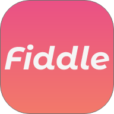

# fiddle (working title)



Welcome to the repository for fiddle.
This app helps musicians collaborate rapidly using their smartphone.
The rapid collaboration is enabled by built in microphones and the ability to record over eachothers audio recordings and sending back consolidated audio files.

This is the masterpiece of my twelve week web development bootcamp at "neue fische" in Cologne, Germany

## Getting Started

These instructions will get you a copy of the project up and running on your local machine for development purposes.

### Installing

After cloning this to your machine, you need to install node_modules on both client and server

Due to `postinstall` you'll only need to do it once in the top level directory.

```
npm install
```


### env Variables you'll need

You will need one .env.development file in your client directory which contains this:

```
REACT_APP_WS_URL=ws://localhost:8080 (Has to match the port in the top level .env)
```

As this application is developed with MongoDB you'll need a .env file in your top level directory with the following content:

```
MONGO_DB_URL = mongodb://<YOUR_MONGO_DB_IP>:<YOUR_MONGO_PORT_PROBABLY_27017>/
MONGO_DB_NAME = <YOUR_MONGO_DB_NAME>
PORT=8080 (Or whatever you prefer)
```

### Running the application

Open two terminals next to eachother

First terminal

```
npm run server
```

Second Terminal

```
npm run client
```
